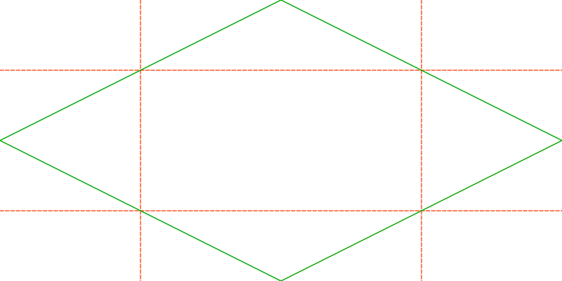
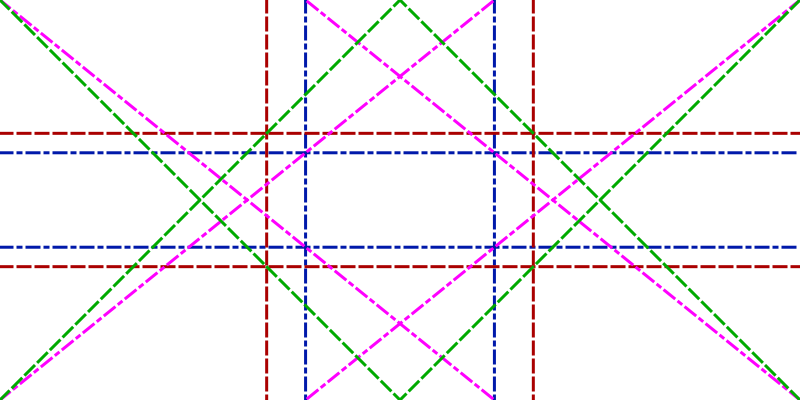
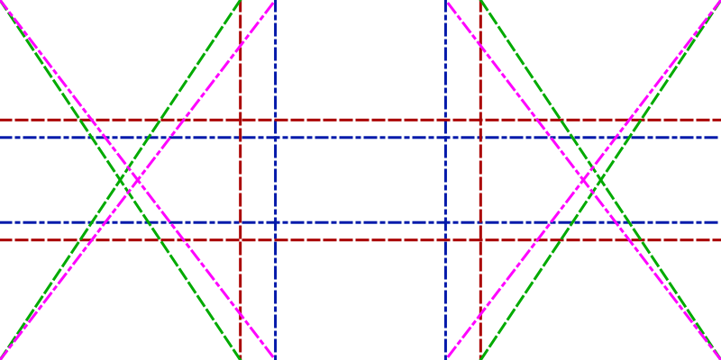
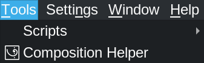
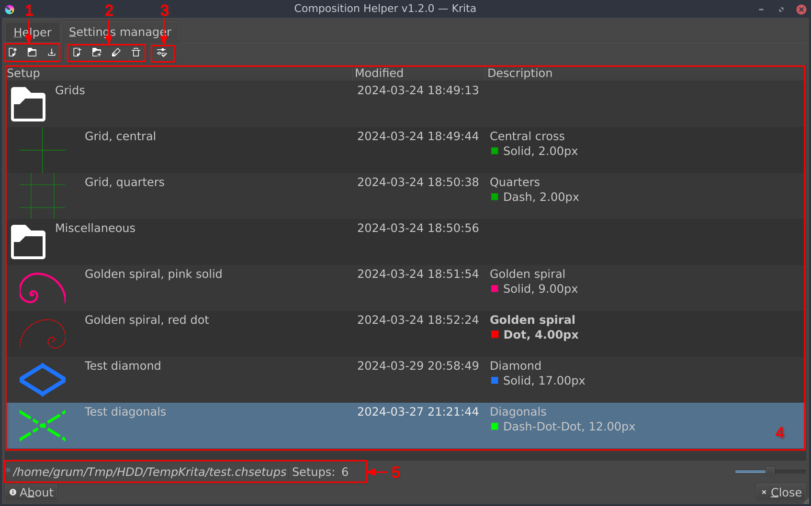

# Composition Helper :: Release 1.2.0 [2024-04-13]

# Main Interface

## Implement *New Helpers*

Some additional *Helpers* have been added to current list:
- Quarters
- Diamond
- Dynamic symmetry (rules of thirds & golden sections)
- Reciprocal lines (rules of thirds & golden sections)

_Quarters & Diamond_

_Dynamic Symmetry based from **Rules of thirds** (Green example) & **Golden sections** (Pink example)_

_Reciprocal lines based from **Rules of thirds** (Green example) & **Golden sections** (Pink example)_

[Feature request #4](https://github.com/Grum999/CompositionHelper/issues/4)

## Implement *Menu access*

Menu to open *Composition Helper* plugin has been moved into *Tools* menu, and:
- An icon has been added
- Menu is enabled/disabled according to active document availability
- In Krita's shortcuts settings, it's now possible to define a shortcut for menu

_Menu with icon_

> Note:
> For Windows users, icons menu are hidden by a hardcoded Krita's rule.
> Icon won't be visible unless menu icons are activated in Windows (possible with some UI tweak...).

[Feature request #5](https://github.com/Grum999/CompositionHelper/issues/5)

## Implement *Settings manager*

The *Settings manager* allows to save different *Helper* setup, organize and reuse them.

| Reference | Description                                                                                                                                                                                                                            |
|-----------|----------------------------------------------------------------------------------------------------------------------------------------------------------------------------------------------------------------------------------------|
| 1         | **Manage settings import/export** - New setting pool - Import a setting pool - Export settings pool  This can be useful to manage backup files or easily use the same settings across different computers               |
| 2         | **Manage settings** - Create a new setup from current *Helper* setup - Create a new folder - Edit selected item - Delete selected item                                                                                     |
| 3         | **Load selected *Helper* setup** Setup will be load and replace current *Helper* setup                                                                                                                                              |
| 4         | Pool settings - Drag'n'Drop to reorganise items - Double-click on item (column *Setup*) to expand/collapse folder or to load *Helper* setup - Double-click on item (column *Description*) to edit folder or to apply *Helper* |
| 5         | Current settings pool file                                                                                                                                                                                                             |

[Feature request #7](https://github.com/Grum999/CompositionHelper/issues/7)

## Fix bug

### Update preview
[Bug fix #6](https://github.com/Grum999/CompositionHelper/issues/6)

When a *Helper* is added, preview is updated to reflect document.
